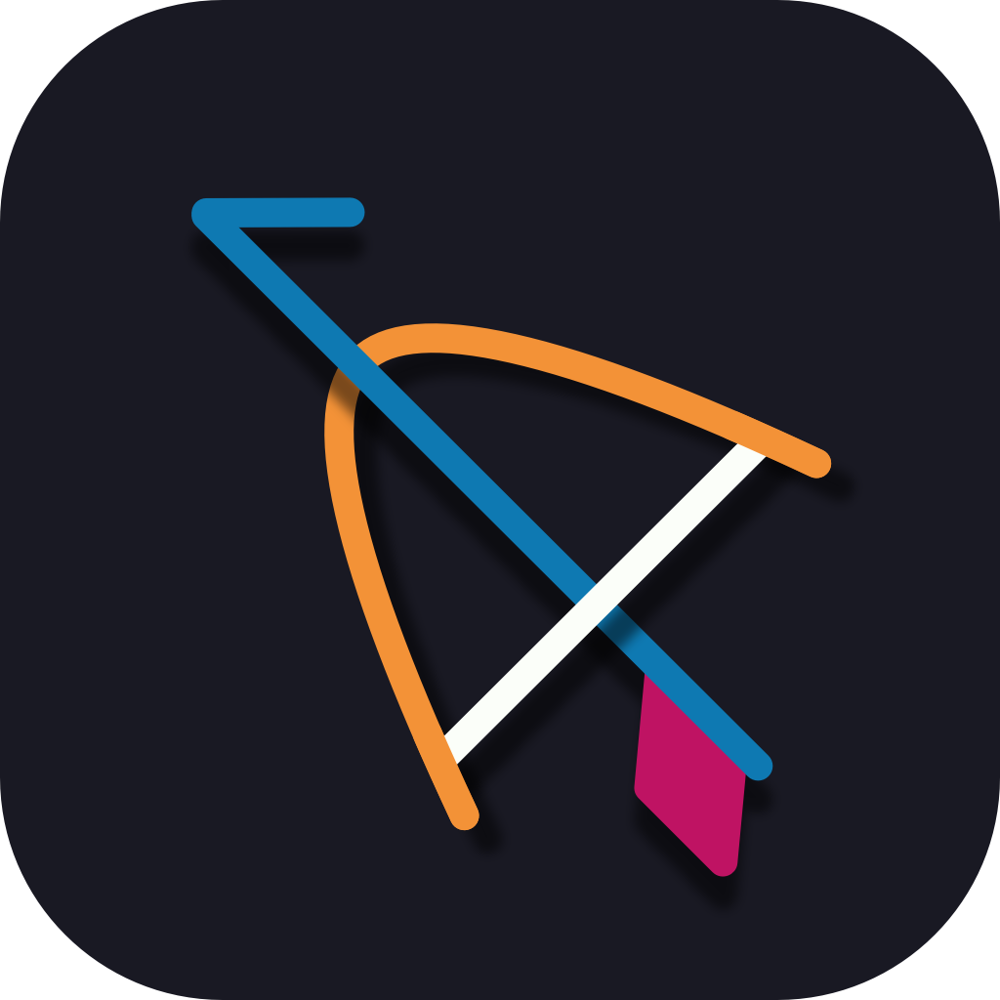
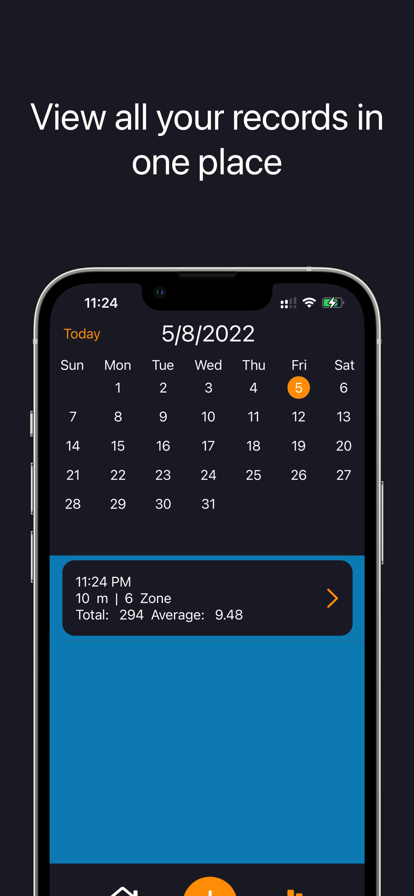
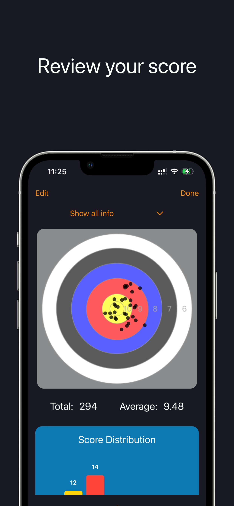
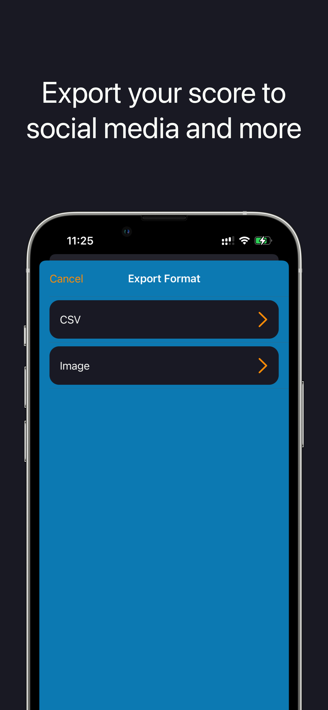
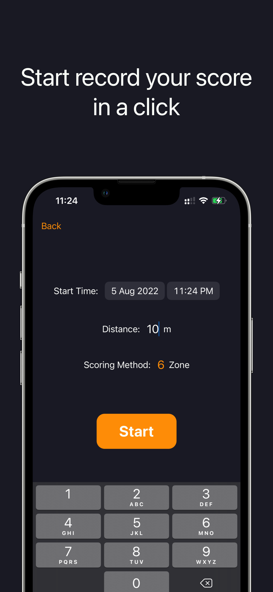
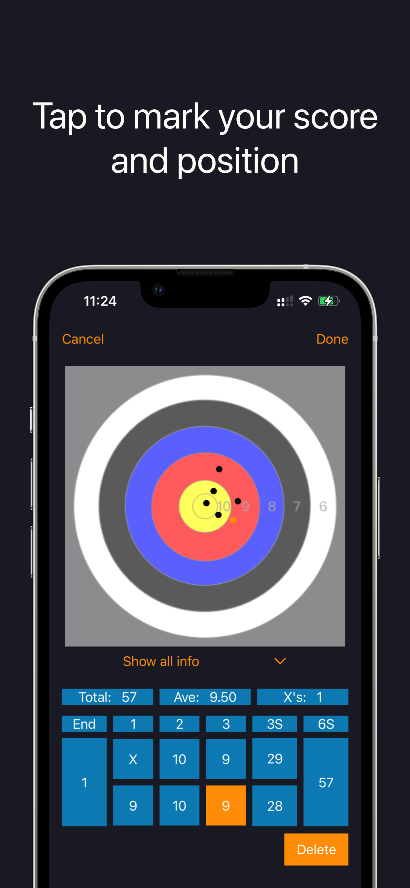
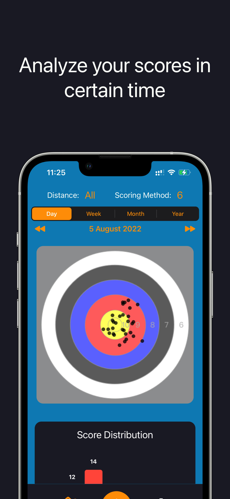
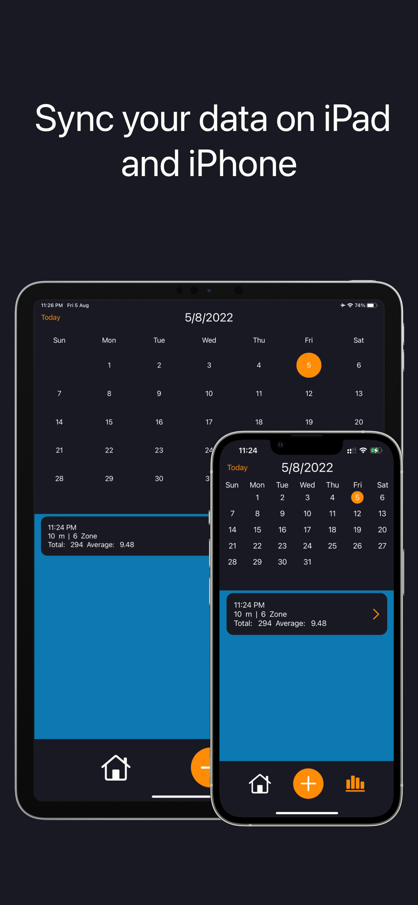

    
    <h1 align="center">Archery Scorer</h1>

## About this project
Archery Scorer is a user-friendly mobile application designed for archery enthusiasts to keep track of their scores, analyze their progress, and share their achievements on social media platforms.

## Framework Used
- SwiftUI 📱
- CoreData 💾
- CloudKit ☁️
- WidgetKit 🎛️
- Google AdMob 📣
- StoreKit 🧾

## Features
1. Sync Data on iPad and iPhone: The app allows you to seamlessly synchronize your data across multiple devices, ensuring that your scores are always up-to-date regardless of the device you are using.

2. Share Score to Social Media: Easily share your archery scores with friends and fellow archers on popular social media platforms. Show off your achievements and inspire others to join in the sport.

3. Record Every Score: The app provides a simple and intuitive interface for recording your archery scores. Log each shot accurately and efficiently, allowing you to track your progress over time.

4. Analysis Chart: Gain valuable insights into your performance with the app's analysis chart. Visualize your scores and identify patterns or areas for improvement. This feature helps you make data-driven decisions to enhance your archery skills.

## Screenshot

    
    
    
    
    
    
    

